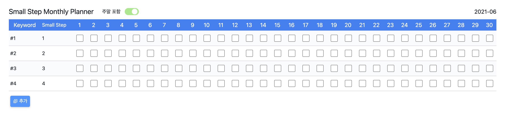

# Small Step Monthly Planner

하루하루 작은 실천으로 큰 변화를 이루는 스몰 스텝

스몰 스텝 플래너로 변화하는 자신을 발견해보는 건 좋은 경험일 거예요.

## 스크린샷

<details open>
  <summary>
    월 별 날짜 관리
  </summary>

  <div>
    <p>스몰 스텝은 월 단위로 하는 일을 실천하고 표시해요.</p>
    <p>단순하게 날짜를 확인하고 개수만 확인할 수 있게 했어요.</p>
    <p>그렇다고 개수에 관심을 가지면 안 돼요. 실천한다는 마음가짐을 중요하게 생각해요.</p>
  </div>

  

</details>

<br />

<details open>
  <summary>
    날짜 추가
  </summary>

  <div>
    <p>날짜 추가하기 버튼을 누르면 날짜를 추가할 수 있는 입력 칸이 나와요.</p>
    <p>형식(yyyy-mm | 2021-06)을 잘 지켜서 입력해야 추가할 수 있어요.</p>
  </div>

  

</details>

<br />

<details open>
  <summary>
    플래너 페이지
  </summary>

  <div>
    <p>스몰 스텝을 실천하고 기록하는 공간이에요.</p>
    <p>날짜를 추가했으면 해당 칸을 클릭해 플래너 페이지에 접속할 수 있어요.</p>
    <p>하루하루 실천할 수 있는 스몰 스텝을 추가하고 기록해요.</p>
    <p>절대 못 했다고 해서 강박하게 생각하기보단 물 흐르듯 자연스럽게 실천할 수 있으면 더 좋아요.</p>
    <p>그렇다고 당연한 것만 적으면 그건 실천이 아니겠죠? 더 나은 내일의 나를 위해 성장할 수 있는 스몰 스텝을 추가하면 좋아요.</p>
    <p>비록 실천하려고 해도 항상 할 순 없는 노릇이죠. 일주일 동안 실천하지 못한 스몰 스텝은 과감하게 버려야 해요. 실천할 수 없는 스몰 스텝이라고 인정하는 것도 하나의 성장이기 때문이에요.</p>
  </div>

  

</details>

<br />

<details open>
  <summary>
    스몰 스텝 추가
  </summary>

  <div>
    <p>스몰 스텝을 추가하는 영역이에요.</p>
    <p>큰 행복이 아니라 작은 행복부터 찾을 수 있도록 스몰 스텝을 추가해봐요.</p>
  </div>

  

</details>

<br />

<blockquote>

  <p>작지만 꾸준한 실천을 통해 일상의 <strong>주인으로 살게 해주는 작은 혁명</strong>을 이루고 싶은신가요?</p>
  <p>큰 행복이 아니라 <strong>작지만 확실한 행복</strong> 부터 찾아봐요.</p>
  <p>억지로 무엇을 하라고 강요하지 않아요. 대신 <strong>마음이 끌리는 아주 작은 시도</strong>를 해보는건 어떨까요?</p>

</blockquote>

<br />

```
📦 Small-Step-Planner
├─ .gitignore
├─ README.md
├─ package.json
├─ public
├─ src
│  ├─ App.tsx
│  ├─ components
│  ├─ index.tsx
│  ├─ pages
│  ├─ reset.css
│  └─ utils
│     ├─ constants
│     ├─ functions
│     ├─ hooks
│     └─ libs
├─ tsconfig.json
└─ yarn.lock
```

©generated by [Project Tree Generator](https://woochanleee.github.io/project-tree-generator)
